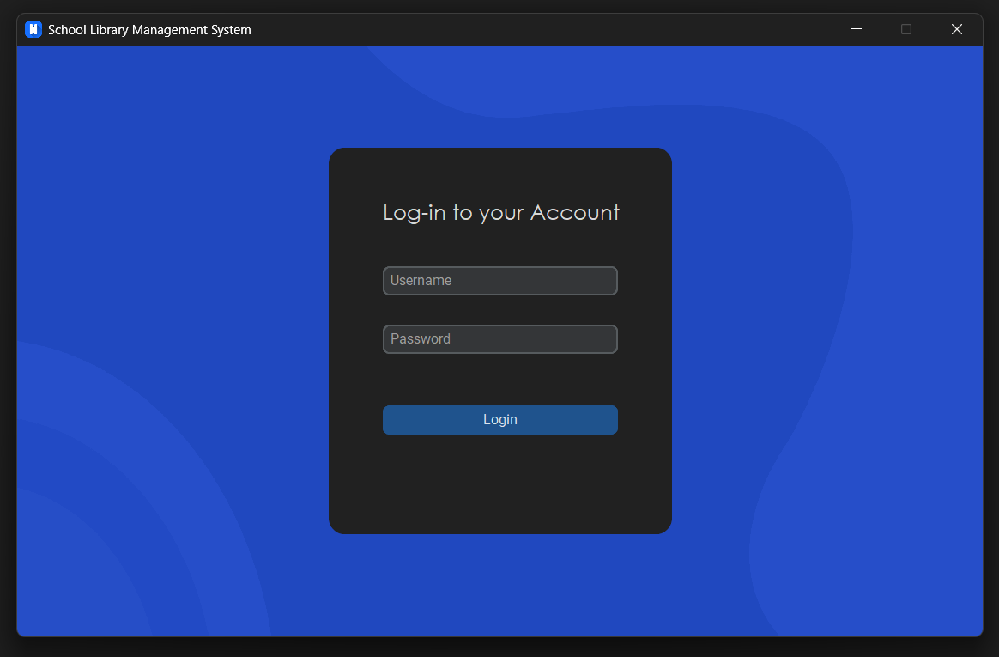
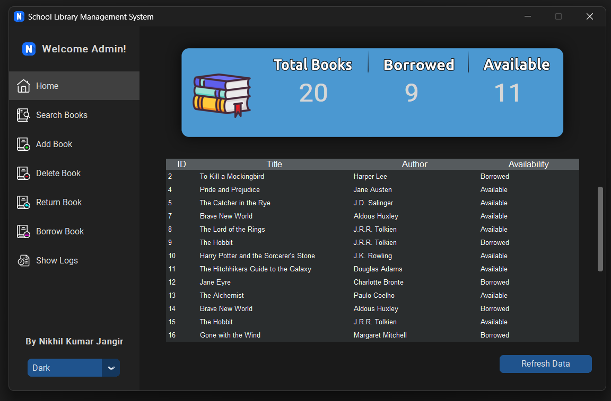
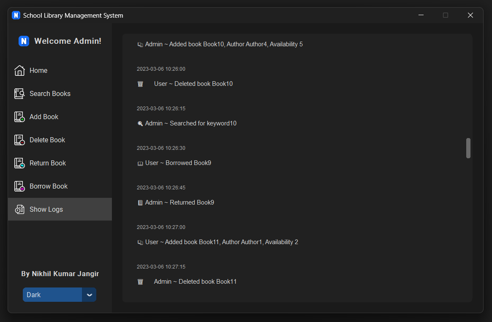

# 📚 School Library Management System
Welcome to the School Library Management System! This project is designed to help manage your library with ease and a touch of fun. Whether you're adding new books, borrowing them, or just browsing!

This Python project was made for my Grade 12 School Competition.

## 📦 Modules Used
- customtkinter (for GUI)
- Pillow
- CTkMessagebox
- requests

## 🚀 Features
- Add, delete, and search for books
- Borrow and return books
- User login and role management
- Beautiful dark theme with custom icons

## 👥 User Roles

The School Library Management System offers two types of user roles with different permissions:

- **Admin View**: The admin account has full access to all features, including adding, deleting, borrowing, and returning books. Admin username is **"Admin"** and password is **"password"**.
- **Student View**: The student account can borrow and return books, and search for available books. Student username is **"User"** and password is **"password"**.

## 📷 Screenshots

```markdown



```

## 🛠️ Installation
1. Clone the repository:
   ```bash
   git clone https://github.com/bogzyeet/customtkinter-library-system.git
   ```
2. Navigate to the project directory:
   ```bash
   cd customtkinter-library-system
   ```
3. Install the required packages:
   ```bash
   pip install -r requirements.txt
   ```
4. Run the application:
   ```bash
   python main.py
   ```

## 🤝 Contributing
Welcoming contributions with open arms! Feel free to fork the repo and submit a pull request.

## 📄 License
This project is licensed under the MIT License - see the LICENSE file for details.

## 🎉 Have Fun!